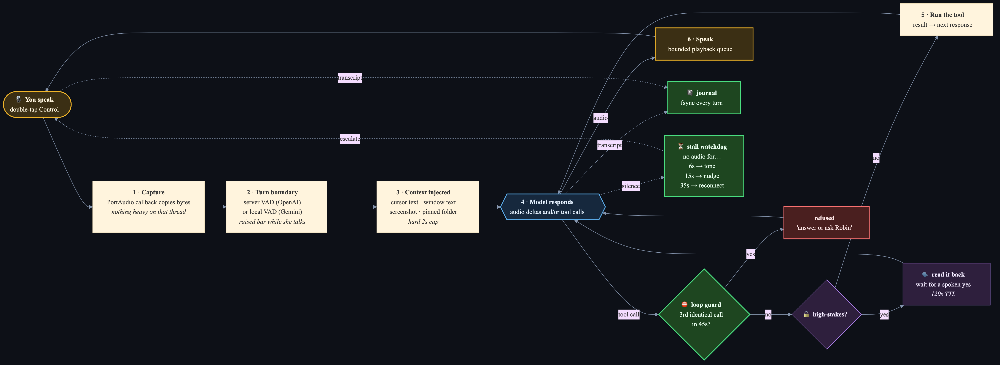
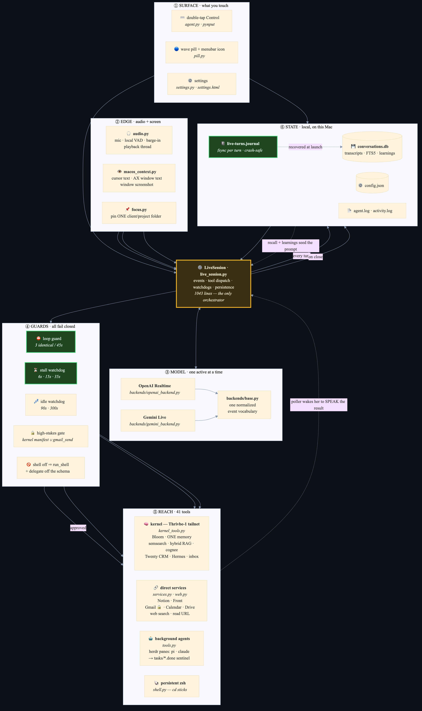
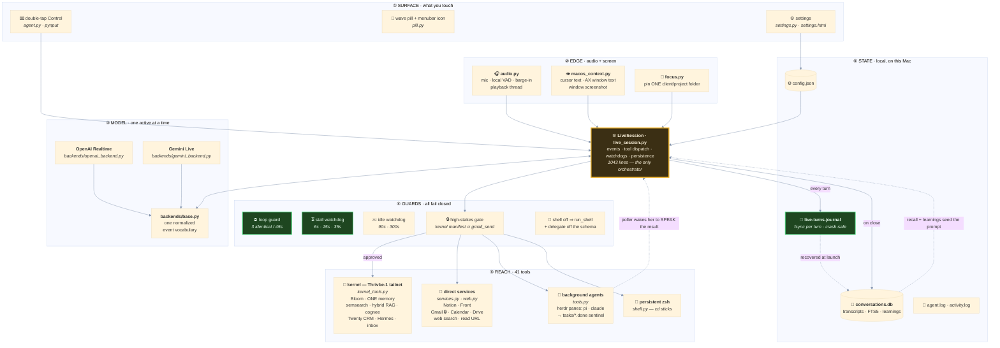

# Thrivbe Voice (Pam) — System Concept

The single map of what Pam is, what she can touch, and how the pieces connect.
Written 2026-08-04 after the crash post-mortem below.

Companions: `README.md` (install + usage) · `PRODUCT.md` (what it's for, commercially)
· `CLAUDE.md` / `AGENTS.md` (working agreements) · `OS-ORCHESTRATOR-PROPOSAL.md` (where
this is heading). This file is the **structural** one — the skeleton.

---

## 1. What it is, in one paragraph

Pam is a macOS menubar app (`rumps`) that holds a **continuous, full-duplex voice
conversation** with a realtime speech model over a WebSocket. Double-tap `Control` and
she's listening. She is not a dictation tool and not a chatbot with a voice skin: mid-
conversation she can read your screen, run shell commands, search your knowledge bases,
file tasks, and hand long work to background coding agents — then wake you up later and
speak the result. Everything runs locally except the model itself and the services she
calls.

**The one-line mental model:** *a duplex audio pipe into a model that holds 41 tools,
wrapped in a process that survives you walking away.*

---

## 2. The map

Two views. **A** is one turn — the loop that runs every time you speak. **B** is the
system — the layers and everything they reach. Sources in `docs/*.mmd`; re-render with
`npx -y @mermaid-js/mermaid-cli@11 -i docs/<name>.mmd -o docs/<name>.png -b "#0d1017" -s 2`.

### A · One turn

### B · The system

Mermaid source for B (inline, if you'd rather read it as text)

> Green = the reliability guards added 2026-08-04.

---

## 3. The files

The tree is split by **surface**, not by layer. `core/` is the brain and knows nothing
about macOS; `mac/` is this machine; `server/` is where the headless surface lands.

**`core/` — the brain. Imports cleanly on a headless Linux box with no PyObjC, no
PortAudio, no Keychain.** Enforced by `tests/test_headless_core.py`, which blocks those
modules at import time and imports every module in here.

| File | Role |
|---|---|
| `live_session.py` | One conversation: event loop, tool dispatch, gates, watchdogs, persistence. **The core.** |
| `tools.py` | The 41-tool schema + the helpers behind delegation, herdr panes, `put_text`. |
| `audio_core.py` | The mic pump and the VAD turn boundaries. Transport-independent — a browser mic reuses it whole. |
| `caps.py` | The capability registry: log sink, notifier, screen context, clipboard, audio transport. **The one seam.** |
| `secrets.py` | One resolver, two providers: store (Keychain) → env fallback → `$CREDENTIALS_DIRECTORY`. |
| `backends/` | Wire protocol per provider. `base.py` normalizes both into one event vocabulary. |
| `kernel_tools.py` | Stdlib client for the thrivbe-os kernel voice API on Thrivbe-1. |
| `services.py` | Direct (non-kernel) service calls: Notion, Front, Gmail, Calendar, Drive. |
| `memory.py` | Conversation store (SQLite + FTS5), durable learnings, crash journal, recall. |
| `focus.py` | Pin one client/project folder as the subject; loads its text into context. |
| `live_prompt.py` | Assembles the system prompt: persona + context + learnings + custom prompt. |
| `config.py` | `config.json`, defaults, `activity()` feed. |
| `settings.py` | Settings state: voice list, HH:MM validator, memory counts, Tools inventory. |
| `shell.py` | Persistent zsh so `cd` sticks across commands. **Mac-only at runtime** — see §7. |
| `web.py` | Web search + URL reading. |
| `paths.py` | RESOURCEPATH-in-a-bundle vs repo-root-in-dev, in one place. |

**`mac/` — this machine.** The only place allowed to import AppKit/Quartz/PyObjC/
sounddevice/rumps/pynput or shell out to `osascript` and the Keychain `security` CLI.

| File | Role |
|---|---|
| `agent.py` | The rumps menubar app. Hotkey, icon state, task poller, launch. **Entry point.** |
| `caps_install.py` | Registers every macOS capability into `core.caps` before a session starts. |
| `audio.py` | PortAudio device enumeration, capture + playback streams (`MacAudioTransport`). |
| `macos_context.py` | Screen context: cursor text, AX window text, window screenshot. |
| `screen.py` / `clipboard.py` / `keychain.py` | The three thin capability adapters over the above + pbcopy + `security`. |
| `settings.py` / `settings.html` | The settings window (NSWindow + WKWebView + the JS bridge). |
| `pill.py` | The floating wave pill. |

`thrivbe_voice.py` at the root is the py2app boot script — it puts Resources on
`sys.path` and calls `mac.agent.main()`. It is **not** called `agent.py`: modulegraph
keys modules by basename and would alias it over `mac/agent.py`, shipping neither.

---

## 4. The 41 tools

**Gated (high-stakes).** Staged, read back to you out loud, executed only on a spoken
"yes" within 120s. Membership = the kernel's `highStakes` manifest ∪ `LOCAL_HIGH_STAKES`,
so adding a gate is a manifest edit, not a code change. **Fails closed:** if the kernel is
unreachable, *every* kernel-backed tool is treated as gated.

| Group | Tools |
|---|---|
| 🐚 **Shell & screen** | `run_shell` · `put_text` · `focus` · `set_prompt` |
| 🤖 **Delegation** | `delegate` · `continue_task` · `fleet` · `close_finished_tasks` · `os_delegate` |
| 🧠 **Kernel memory** | `kernel_remember` · `kernel_recall` · `kernel_memo` · `kernel_status` · `kernel_decide` |
| 🔍 **Search** | `semsearch_query` · `hybrid_rag_search` · `cognee_ask` · `graph_get_node` · `graph_get_document` · `web_search` · `read_url` |
| 🌱 **Bloom** | `bloom_create_task` · `bloom_update_task` · `bloom_comment_task` · `bloom_list_projects` · `bloom_list_tasks` |
| 📇 **CRM / fleet / inbox** | `twenty_search_contacts` · `hermes_fleet` · `list_inbox_items` |
| 📝 **Notion** | `notion_create_task` · `notion_search` · `notion_list_tasks` · `notion_update_task` |
| ✉️ **Comms** | `gmail_search` · **`gmail_send`** 🔒 · `front_search` · `front_draft` · `calendar_add` · `drive_search` |
| 💾 **Local memory** | `remember` · `recall` |

`run_shell` and `delegate` are **removed from the schema entirely** unless
`live.agentic_shell` is on — fail-closed, not prompt-enforced.

---

## 5. How a turn actually runs

1. **You speak.** PortAudio callback copies bytes (and does nothing else — heavy work on
   that thread risks input glitches) onto the session's asyncio queue.
2. **VAD decides the turn boundary.** OpenAI does it server-side; on Gemini a local VAD
   with a raised bar while *she's* talking, so an open-ear headset leaking her own voice
   doesn't read as a barge-in.
3. **Speech stops → context is injected.** Screen text (+ optional screenshot) grabbed
   concurrently, hard-capped at 2s so a slow AppleScript can't stall the reply.
4. **Model responds** — audio deltas, and/or tool calls.
5. **Tool call → `_do_tool`.** Loop guard → verbatim-words wrapper for delegating tools →
   high-stakes gate → dispatch → result back → trigger the next response.
6. **Turn recorded** to `_turns` *and* fsync'd to the journal.
7. **Session closes** → transcript to SQLite → background `_learn` pass extracts durable
   learnings (and supersedes contradicted ones) → journal cleared.

**Delegation is the interesting one.** `delegate` hands work to a herdr pane running `pi`
or `claude`, prefixed with *your verbatim ASR words* — ground truth independent of how
faithfully the model paraphrased you into the tool argument. The pane writes a report +
a `.done` sentinel; `agent.py`'s poller sees it, reopens a session, and **speaks the
result at you**, honouring quiet hours.

---

## 6. Failure modes (and what now guards them)

The 2026-08-04 crash, which is why this document exists. Four independent bugs stacked:

| # | Failure | Guard | Test |
|---|---|---|---|
| 1 | Model fired `focus`+`semsearch_query` with identical args **16× in 21s**. Nothing bounded it — every tool result triggers a response that can call the same tool again. Silence to you; enough churn that the server aborted (`1008`). | **Loop guard** — the 3rd identical `(tool, args)` in 45s is refused with an explanation that tells her to answer or ask. Cleared on each new spoken turn. | `test_reliability_2026_08_04.py` ×3 |
| 2 | **72 seconds** of you talking into a session that had stopped answering, with no signal. | **Stall watchdog** — 6s soft tone, 15s "say one sentence out loud", 35s drop the socket and reconnect. Tunable via `live.stall_*`. | ×5 |
| 3 | `_start_audio` called `sd._terminate()` (frees PortAudio's **global** state) while the previous attempt's player thread and streams were still alive → use-after-free on CoreAudio's IO thread → **SIGSEGV**. Reconnect was a coin flip. | Per-attempt `_audio_stop` event; the player owns and closes its own stream; teardown **joins** it; `_audio_dirty` blocks the re-init if it can't prove the join. | ×3 |
| 4 | Transcripts only persisted in `_run`'s `finally` — **a segfault doesn't run `finally`**, so the whole conversation was lost. | Every turn fsync'd to `live-turns.journal`; recovered into SQLite at next launch; cleared on clean save. | ×2 |
| 5 | Guard #2 then fired for real at 16:39 the same day and **recovered into silence**: socket dropped, reconnect succeeded in 1s, nothing was spoken, history was gone. Indistinguishable from a dead app — the session was killed a minute later. | **Session resumption** — Gemini's `sessionResumption` handle is stored per update and replayed on the next `setup`, so a reconnect resumes the conversation server-side; `goAway` is logged rather than silently fatal. **Spoken recovery** — `_speak_reconnect` always says it dropped out and asks you to repeat, and admits the thread is gone when there was no handle to resume. | ×2 |

Pre-existing guards worth knowing: idle watchdog (90s quiet / 300s cap) so a forgotten-on
mic doesn't answer ambient speech · fail-closed high-stakes set when the kernel is
unreachable · bounded playback queue (drop oldest, not unbounded latency) · `run_shell`/
`delegate` stripped from the schema when the agentic shell is off · herdr argv denylist.

---

## 7. Boundaries

- **Kernel-dependent, not kernel-blocked.** If Thrivbe-1 is unreachable the kernel tools
  fail and the gate set stays maximally conservative — she keeps talking.
- **One writer.** SQLite in WAL; the `_learn` thread and the main thread both write.
- **Privacy is opt-in per layer.** Cursor text on; window text and screenshots off by
  default (`privacy.*`). All three off → she answers from speech alone.
- **One direction.** `mac` imports `core`; `core` never imports `mac`. Anything the
  brain needs from a machine is a capability in `core.caps` (or the secret store in
  `core.secrets`), registered by the surface at startup. Three tests hold the line:
  `test_headless_core.py` (imports, no osascript/pbcopy/security in `core`) and
  `test_bundle_deps.py` (the .app keeps shipping what `mac/` imports, and what those
  dependencies themselves import).
- **Known `core` → Mac leaks — runtime, not import time.** `core/` *imports* clean on
  Linux; two capabilities inside it still assume this Mac when actually called. They are
  faithful moves of pre-split code, deliberately left alone rather than fixed blind.
  **Owner: whoever builds `server/`** — decide there, do not discover them there.
  1. `core/shell.py` — hard-codes `/bin/zsh`, `source ~/.zshrc`, and a zsh-only sentinel
     `print -r -- "<mark>$?"`. On Linux `Shell()` raises `FileNotFoundError: /bin/zsh`
     at construction, so `run_shell` (a live tool, not dead code) cannot start, and
     `tests/test_shell.py`'s two cases fail there.
     **Do not just swap the binary.** Measured 2026-08-09: with bash the sentinel is
     frequently emitted in the same read as the command's own output, and `run()`'s
     `select()` then reports the pipe empty while the sentinel is already sitting in the
     `TextIOWrapper` buffer — the command "times out" after 20s and respawns the shell.
     The same race exists with zsh — feed `echo hello\nprint -r -- "MARK$?"\n` to a
     pipe-fed `/bin/zsh`, then `select(2s)` → not ready, and the very next `readline()`
     returns `MARK0` in 0.000s. zsh just loses it rarely enough that nobody has noticed.
     A server surface needs the capture loop to
     track its own line buffer instead of trusting `select`, *and* a shell spec
     (argv / rc line / sentinel command) behind `core.caps`. Both, or neither.
  2. `core/tools.py:601` — `HERDR = ~/.local/bin/herdr`, Robin's Mac-only pane manager.
     Softer: `_herdr()` catches every exception and returns `None`, so on a host without
     it the lane tools degrade to "no lanes" instead of crashing. The server surface
     needs its own delegation backend behind the same `_herdr()` seam, not a path fix.
- **Deploy = `./reload_app.sh`** (quit → `build_app.sh` → relaunch). It signs with the
  stable *Thrivbe Voice Dev* identity so Accessibility/Input-Monitoring grants survive.
  Editing the source dir alone changes nothing — `core/` and `mac/` are copied into
  `Contents/Resources/lib/python3.12/`. Verify a deploy by those directories' mtime.
- **Use `.venv/bin/python` (3.12).** System `python3` is 3.9 and dies on PEP 604 unions.
