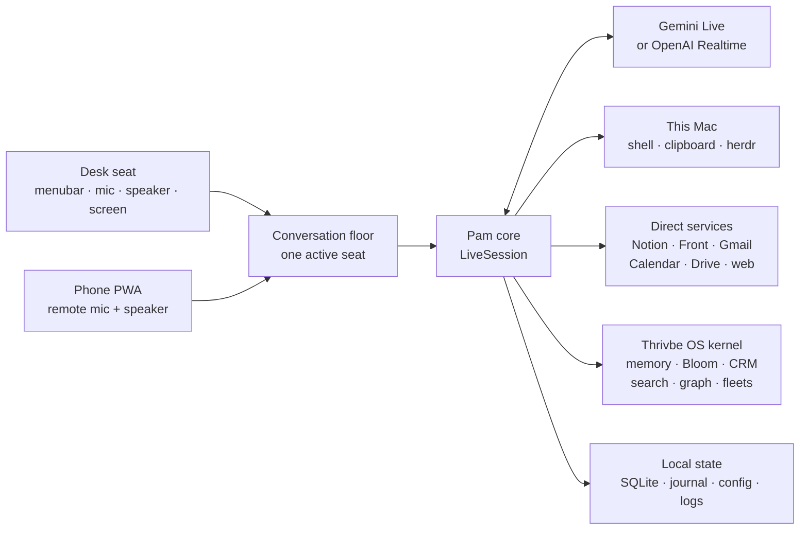

# Pam — Thrivbe Voice

Pam is a full-duplex, agentic voice assistant that runs as a macOS menubar app.
Double-tap **Control** and speak naturally: she can answer with live screen context,
use connected business systems, delegate longer work to background agents, remember
across conversations, and speak the result when that work finishes.

Pam has **one brain on the Mac and two seats**:

- **Desk:** the menubar app, Mac microphone and speaker, screen context, clipboard,
  and—when enabled—a persistent shell.
- **Phone PWA:** the iPhone is a remote microphone and speaker over the tailnet. It
  drives the same Pam process, memory, tools, and conversations; it is not a second
  agent.

The live provider is selectable in Settings:

- **Gemini Live** — the current production path, using `gemini-3.1-flash-live-preview`.
- **OpenAI Realtime** — the alternate realtime speech-to-speech backend.

Both providers are normalized behind the same session, tool, memory, and safety
layers. Model keys are stored in the macOS Keychain.

## What Pam can do today

- Hold a continuous, barge-in-able voice conversation with streamed audio in both
  directions.
- Read text under the cursor, focused-window Accessibility text, and an optional
  window screenshot on every desktop turn.
- Use **49 declared tools** spanning the Mac, Notion, email, calendar, Drive, CRM,
  Bloom, knowledge search, memory, advisor simulations, and agent fleets.
- Hand long coding or research work to named `herdr` lanes and return immediately;
  finished work is announced aloud later.
- Continue an existing lane, inspect terminal output, list all running work, and close
  finished Pam-owned lanes.
- Store searchable local conversations and durable learnings, with crash-safe turn
  journaling.
- Use the same assistant from the phone without exposing the desktop shell, screen, or
  paste controls to that surface.
- Stage high-stakes actions, read the preview aloud, and wait for an explicit spoken
  confirmation.
- Detect repeated or runaway tool use, stalled model responses, dead sockets, and
  abandoned sessions.

## System map



The architectural boundary is deliberate:

- `core/` is the surface-independent brain. It imports without AppKit, PortAudio,
  Keychain, or other Mac-only dependencies.
- `mac/` provides the menubar, audio devices, hotkey, screen, clipboard, settings,
  phone host, and Mac capability adapters.
- `server/` is the browser/PWA transport running inside the Mac app process.
- `core/backends/` contains only provider wire behavior; the rest of Pam consumes one
  normalized event vocabulary.

For the deeper structural map, see [ARCHITECTURE.md](ARCHITECTURE.md). For the phone
transport and threat boundary, see [server/README.md](server/README.md).

## One voice turn

1. The active surface streams PCM16 microphone audio into `LiveSession`.
2. Turn detection decides when speech starts and ends. Gemini uses local VAD; OpenAI
   uses its configured Realtime turn detection.
3. On the desk, screen text and the optional screenshot are captured concurrently.
4. For Gemini, that context is sent as realtime text/video **before one
   `activityEnd`**. Screen capture is prefetched while the user speaks, so context does
   not add a second model turn or a long serial wait.
5. The provider streams spoken audio, requests tools, or both.
6. Tool results return through the provider-native continuation path. Gemini continues
   directly from `toolResponse`; OpenAI receives `response.create` where required.
7. User and agent transcripts are journaled during the session and persisted to SQLite
   when it closes. Durable learnings are extracted in the background.

The Gemini ordering in step 4 is important. Sending incomplete screen context after
the response boundary previously left most turns waiting for a 15-second watchdog.
The current path restores roughly two-second response starts in the deployed desktop
trial while keeping text and screenshot context.

## Connected tools

`core/tools.py` currently declares **49 tools**. Settings → **Tools** shows the live
schema, descriptions, arguments, disabled state, and confirmation badges for the next
conversation.

| Area | Connected tools | What they reach |
|---|---|---|
| Mac and session | `run_shell`, `put_text`, `focus`, `set_prompt`, `end_conversation` | Persistent zsh, clipboard/paste, project context, standing instructions, and session control. |
| Local and shared memory | `remember`, `recall`, `kernel_remember`, `kernel_recall`, `kernel_memo` | Local learnings/conversations plus Thrivbe OS ONE memory and unified inbox. |
| Background work and fleets | `delegate`, `continue_task`, `fleet`, `read_pane`, `close_finished_tasks`, `os_delegate`, `hermes_fleet` | Local `herdr` lanes, Thrivbe OS workers, and Hermes fleet status. |
| Notion | `notion_create_task`, `notion_search`, `notion_read_page`, `notion_list_tasks`, `notion_update_task` | Direct Notion task and page APIs. Task updates are intentionally limited to status and due date; broader edits are delegated. |
| Mail, calendar, and files | `front_search`, `front_draft`, `gmail_search`, `gmail_send`, `calendar_add`, `calendar_list`, `drive_search` | Front, Gmail, Google Calendar, and Google Drive. Front creates drafts; Gmail send is confirmation-gated. |
| Kernel control | `kernel_status`, `kernel_decide` | Pending approvals, attention items, recent runs, and explicit approval decisions. |
| Bloom | `bloom_create_task`, `bloom_update_task`, `bloom_comment_task`, `bloom_list_projects`, `bloom_list_tasks` | Bloom projects and task boards through the Thrivbe OS kernel. Mutations follow kernel approval policy. |
| Search, graph, and advice | `web_search`, `read_url`, `semsearch_query`, `hybrid_rag_search`, `cognee_ask`, `os_map_search`, `os_map_overview`, `council_list_advisors`, `council_ask_advisor`, `graph_get_node`, `graph_get_document` | Live web, Notion/wiki/skills/code search, community knowledge, the OS inventory, advisor simulations, and the system graph. |
| CRM and inbox | `twenty_search_contacts`, `list_inbox_items` | Twenty CRM and the combined email/SMS/Beeper/LinkedIn inbox. |

### How tool availability is decided

The 49-tool inventory is the superset, not a promise that every seat always receives
every tool:

- **Agentic shell off:** `run_shell` and `delegate` are removed from the provider
  schema. This is fail-closed; the model cannot merely decide to ignore the toggle.
- **Phone seat:** `run_shell` and `put_text` are absent. The phone cannot run an
  unwatched shell or paste into a Mac window the user cannot see. Delegation and the
  connected services remain available because the actual work still runs on the Mac.
- **Unknown surface:** receives the strict phone exclusions rather than desktop powers.
- The dispatcher repeats the profile check even if a provider requests a stale or
  hallucinated tool name.

### Direct, local, and kernel-backed paths

- **Local:** shell, clipboard, focus, memory, conversation control, and `herdr` pane
  operations execute on the Mac process.
- **Direct service clients:** Notion, Front, Gmail, Calendar, Drive, and web access use
  the handlers in `core/services.py` and `core/web.py` without an MCP layer in the
  realtime hot path.
- **Kernel-backed:** Bloom, Twenty CRM, shared memory, semantic/RAG/graph searches,
  advisor council, OS inventory, inbox, Hermes, approvals, and business delegation go
  through the Thrivbe OS kernel.

### Confirmation and loop protection

At session setup, Pam combines the kernel's live `highStakes` manifest with local
high-stakes tools such as `gmail_send`. A gated call is staged, summarized aloud, and
executed only after a valid spoken confirmation. If the kernel manifest cannot be
read, all kernel tools are treated as high-stakes rather than silently ungated.

Tool work is bounded independently of the model:

- After three identical calls inside 45 seconds, the next repeat is refused.
- Six calls to the same tool name with changing arguments are refused.
- Twelve tool calls for one genuine user utterance is the absolute ceiling.
- Repeated writes to the same target are stopped before they can thrash a record.
- A refusal breaker prevents the model from looping on the refusal response itself.

## Desk experience

1. Launch **Thrivbe Voice.app**.
2. Double-tap **Control** to start Pam. Double-tap again to end the conversation.
3. Speak normally. You can interrupt while she is talking; output is flushed and the
   new turn takes the floor.
4. Watch the menubar/pill state: listening, thinking/acting, or speaking.

Settings controls the provider, model keys, voice, microphone, speaker, base folder,
screen context layers, agentic shell, delegate backend, memory, quiet hours, urgent
wake, activity window, and login behavior. Changes apply to the next conversation
unless the panel says otherwise.

## Phone PWA

The phone surface is off by default because it opens a listener. To use it:

1. Choose **📱 Phone surface: off** from the menubar to start it.
2. Choose **Copy phone link + token**.
3. Open the HTTPS URL on the iPhone, enter the token, and optionally add the page to the
   Home Screen.
4. Start talking. The browser sends microphone PCM over WebSocket and plays Pam's
   returned audio through an `AudioWorklet`.

The PWA is reached through `tailscale serve` on port `8443`, which proxies to the
loopback-only FastAPI listener on `127.0.0.1:8767`. The access token is not displayed in
the menubar, and the listener refuses broad `0.0.0.0` binding.

Only one conversation can own Pam at a time. The shared conversation floor reports
whether the desk or phone holds it and supports an explicit phone takeover that ends
and persists the desk session through the normal path.

## Memory and background work

Pam's local state lives under `~/Library/Application Support/ThrivbeVoice/`:

- `conversations.db` stores transcripts, FTS search data, and durable learnings.
- `live-turns.journal` is fsynced during a conversation so a crash or power loss does
  not erase the unsaved transcript.
- `config.json` stores non-secret settings with owner-only permissions.
- Background task sidecars/results let the menubar poller announce finished work.

The prompt is seeded with relevant recall and recent learnings. On clean close, a
background learning pass extracts durable facts and supersedes contradicted ones.
Optional external recall providers can also be configured in Settings.

Delegated jobs survive the voice conversation. Pam creates or adopts a named `herdr`
lane, passes the user's verbatim transcribed request, and watches for its completion
sentinel. Results are spoken automatically unless quiet hours defer the announcement.

## Reliability and privacy boundaries

- Stall watchdog: working tone at 6 seconds, spoken nudge at 15 seconds, reconnect at
  35 seconds by default.
- Gemini session-resumption handles preserve server-side conversation state across a
  reconnect when the provider allows it.
- Idle and maximum-session watchdogs stop forgotten conversations.
- Audio playback is bounded; stale audio is dropped instead of building latency.
- Desktop context can be enabled independently for cursor text, window text, and a
  screenshot. All three off means speech-only turns.
- Screen capture fails closed for excluded apps or when the frontmost window cannot be
  identified.
- Third-party PII tools are marked so future routed fallback models must pin one named,
  no-train subprocess rather than fan out through an unnamed router.
- Secrets are removed from subprocess environments before model-authored shell commands
  run.
- The optional reverse channel is disabled by default, workspace-scoped, tailnet-bound,
  and separately confirmation-gated. It is not part of the normal phone conversation
  path.

## Build, run, and deploy

Requirements: macOS, Homebrew Python 3.12 at `/opt/homebrew/bin/python3.12`, and the
permissions listed below.

Build the self-contained app bundle:

```bash
./build_app.sh
```

The script creates/refreshes `.venv`, installs dependencies, builds with `py2app`,
copies `Thrivbe Voice.app` to the repository root, signs it, and verifies the signature.
Run `./make_signing_cert.sh` once to create the stable **Thrivbe Voice Dev** identity;
otherwise ad-hoc signing can invalidate macOS privacy grants after a rebuild.

Launch the bundle:

```bash
./run.sh
```

Deploy through the gated workflow:

```bash
./deploy.sh --dry-run   # inspect gates and commands
./deploy.sh mac         # rebuild/relaunch and verify every shipped Python file
./deploy.sh server      # push and deploy the exact Git SHA to Thrivbe-1
./deploy.sh             # both surfaces
```

Deployment refuses tool/prompt/high-stakes drift, an active conversation, and—for the
server leg—an uncommitted tree. The server is deployed from Git, never by copying an
ad-hoc list of files.

## Permissions and secrets

Grant permissions to **Thrivbe Voice.app**, not to a Homebrew Python executable:

1. **Microphone** — live audio input.
2. **Accessibility** — cursor and focused-window text.
3. **Input Monitoring** — the global double-Control hotkey.
4. **Screen Recording** — only required for screenshot/vision context.
5. **Automation** — frontmost application/window queries when macOS prompts.

After changing Accessibility, Input Monitoring, or Screen Recording, quit and relaunch
the app.

OpenAI and Gemini keys can be entered in Settings and are stored in the macOS Keychain
under the `ThrivbeVoice` service. Development may fall back to environment variables;
systemd deployments may use `$CREDENTIALS_DIRECTORY`. Config files never store model
API keys.

## Testing

```bash
.venv/bin/python -m pytest -q
./drift_gate.sh
./deploy.sh --dry-run
```

The suite covers provider normalization, Gemini's ordered context boundary, tool
continuation, screen/privacy gates, confirmations, loop/thrash breakers, crash recovery,
headless `core` imports, bundle dependencies, phone authentication/audio/floor behavior,
reverse-channel sandboxing, and deployment refusal paths.

## Logs and local files

- Agent log: `~/Library/Logs/ThrivbeVoice/agent.log`
- Activity journal: `~/Library/Logs/ThrivbeVoice/activity.log`
- Config and memory: `~/Library/Application Support/ThrivbeVoice/`
- Source-level architecture: [ARCHITECTURE.md](ARCHITECTURE.md)
- Product direction: [PRODUCT.md](PRODUCT.md)

Pam can run commands and change external systems when the relevant capabilities are
enabled. Treat the Agentic shell toggle, phone listener, provider keys, and
confirmation gates as real security boundaries—not convenience settings.
